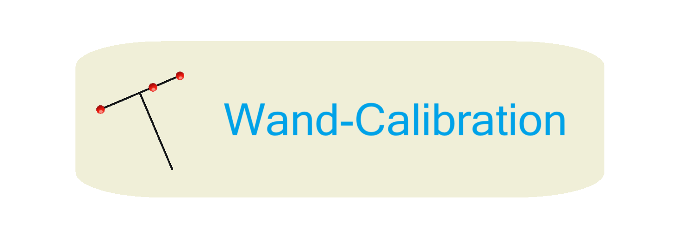

<p align="center">

</p>

<div align="center">

 |[English](https://github.com/Vancouver-wen/WandCalibration) | [中文简体](docs/README_CN.md) |
</div>

---
<p align="center">
<b>代码和数据</b> 来自 2024年商汤科技IRDC智能体育团队的专利
</br>
<a href="https://github.com/Vancouver-wen/WandCalibration"> Wand-Calibration: Calibrate Multi-Camera-System With 3 Marker Wand
</a>
    </br>
    </br>
    <a href="https://www.python.org/">
        
    </a>
    <a href="https://copyright.princeton.edu/policy">
        
    </a>
    <a href="https://badge.fury.io/py/swebench">
        
    </a>
</p>

https://github.com/user-attachments/assets/2ed1ab6d-a460-4aef-8a22-444395619660

## 📰 News
* **[2024年07月26日]**: 我们的挥杆标定技术已经在[巴黎奥运会 🔗](https://olympics.com/en/paris-2024)的[乒乓球](https://h.xinhuaxmt.com/vh512/share/12129448)和[射箭](https://mp.weixin.qq.com/s/ZxIvB2N_dKBc4UrcW5A73A)项目中得到应用！
* **[2024年06月15日]**: 挥杆标定已在我们与 [Snow51](https://snowhowchina.com/cn/snow-51/) 的商业合作中使用！ ([bilibili 🔗](https://www.bilibili.com/video/BV1avJVeKEFL))
* **[2024年06月12日]**: 我们已完成各种场景下的测试，并发布了[挥杆标定](https://github.com/Vancouver-wen/WandCalibration)的使用指南！([bilibili 🔗](https://www.bilibili.com/video/BV1HQgcebEx8))
* **[2024年05月16日]**: [挥杆标定](https://www.bilibili.com/video/BV13rJVeuE1L)初步开发完成！

## 👋 Overview
挥杆标定是一个用于多相机联合标定的工具，它通过挥动T型标定杆来实现多个相机的联合标定。给定一组捕获的校准图像，这个工具可以返回精确的相机内参和外参。这对于大幅面高精度定位与测量、场景拼接以及3D人体姿态估计等应用尤为重要。


## 🚀 Set Up
挥杆标定代码可以在Windows、Ubuntu和Mac上运行。
你首先需要有一个[Anaconda](https://www.anaconda.com/) Python环境，然后按照以下步骤操作：
```bash
conda create -n wandcalibration python=3.9
conda activate wandcalibration
conda install pyqt==5.12.3 --verbose
pip install -r requirements.txt --verbose
python main.py --config "config file path" 
# default config path in config/cfg_uni.yaml
```

## 💽 Usage
> [!注意]
> 1. 收集的标定图像必须是帧同步的。
>
> 2. 捆绑调整对内参的初始值非常敏感。内参的准确性直接影响捆绑调整的上限。
>
> 3. 如果你想构建自己的校准数据，请按照[**_bluePrint/Material.md_**](https://github.com/Vancouver-wen/WandCalibration/blob/main/bluePrint/Material.md)中阐述的步骤进行。


使用准备好的内参标定数据和外参标定数据：
```bash
cd WandCalibration
# download file from https://drive.google.com/file/d/196Ow0GzzVFBvj4z0CCTwVlLGJvAHSYbq/view?usp=sharing
unzip imageCollect.zip
```
组织好的目录应该如下所示：
```bash
|-- WandCalibration # root path
    |-- config
    |-- ...
    |-- intrinsicParameter
    |-- extrinsicParameter
    |-- imageCollect
    |   |-- board
    |   |   |-- cam1
    |   |   |   |-- image1.[jpg png]
    |   |   |   |-- ...
    |   |   |   |-- imagek.[jpg png]
    |   |-- empty
    |   |   |-- cam1
    |   |   |   |-- image1.[jpg png]
    |   |   |   |-- ...
    |   |   |   |-- imagek.[jpg png]
    |   |-- pole
    |   |   |-- cam1
    |   |   |   |-- image1.[jpg png]
    |   |   |   |-- ...
    |   |   |   |-- imagek.[jpg png]
    |   |-- wand
    |   |   |-- cam1
    |   |   |   |-- image1.[jpg png]
    |   |   |   |-- ...
    |   |   |   |-- imagek.[jpg png]
```

## ⬇️ Downloads
| Datasets | Google Drive | Baidu Netdisk |
| - | - | - |
| Indoor Tabletennis | [imageCollect.zip](https://drive.google.com/file/d/196Ow0GzzVFBvj4z0CCTwVlLGJvAHSYbq/view?usp=sharing) | [imageCollect](https://pan.baidu.com/s/1SihJdx6WulFQqCobCZn3_w?pwd=vwys) |

## 🍎 Issues
欢迎您提出宝贵的建议！

## 💫 Contributions
我们非常希望听到来自计算机视觉、机器学习以及软件工程研究社区的广泛声音，我们欢迎任何形式的贡献、拉取请求或问题！

为此，请提交一个新的拉取请求或问题，并相应地填写相应的模板。我们会尽快跟进！

联系人： [Zihao Wen](https://github.com/Vancouver-wen) 和 [Terry Liu](https://github.com/TerryLiu007) （电子邮件：1052951572@qq.com , sdjnltr@gmail.com）。

## ✍️ Citation
如果您觉得我们的工作有帮助，请使用以下引用。
```
@software{repository:wand-calibration,
  author = {ZihaoWen, TerryLiu},
  title = {Wand Calibration},
  year = {2024},
  publisher = {GitHub},
  journal = {GitHub repository},
  howpublished = {\url{https://github.com/Vancouver-wen/WandCalibration}}
}
```

## 🪪 License
AVGP V3. 检查 `LICENSE` 文件。
